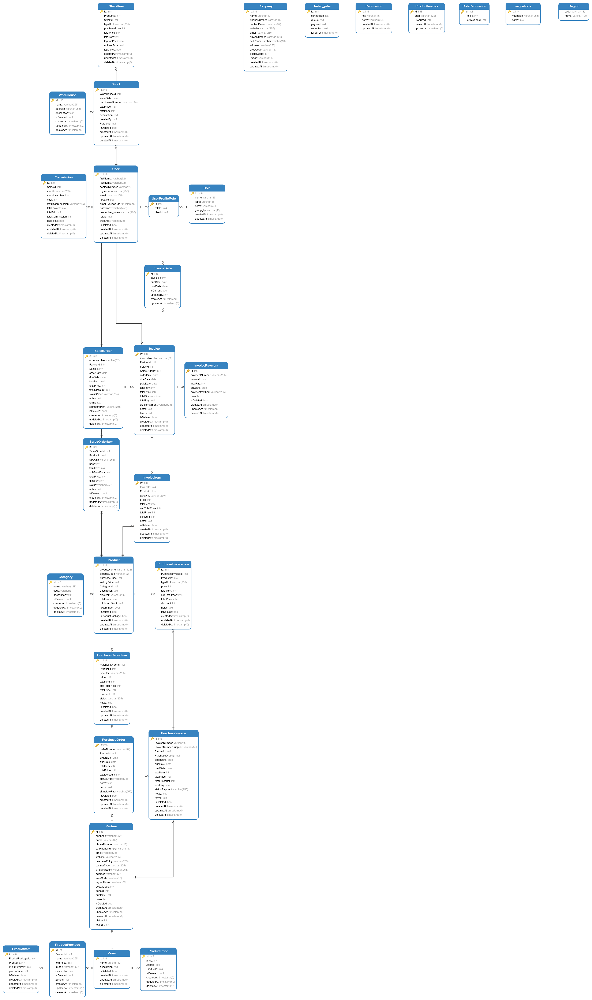

**IMPORTANT!**\
**Please use yarn, instead of npm**\
**Please install prettier extension for auto formatting**

# ERD


# Database and Redis

## 1. Setting Up
Run the following command in the directory (`/HADY/deploy/docker`) where docker-compose.yml exists<br/>
**Can run the scripts inside API directory as well.**

Init Container
```
docker-compose up -d
```

Destroy Container
```
docker-compose down
```

Stop Container
```
docker-compose stop
```

Start Container
```
docker-compose start -d
```

<br/>

## 2. Init and Seed Data into the database for testing
SQL dumps should be in `./seeds` folder. Dropping and starting the container will reinit the data

**The files will be run in sequence. So Schema should always be 01-schema.sql**

<br/>

## 3. Exposed Ports
1. PostgreSQL -> 5432
2. Redis -> 6379

## 4. To modify database schema

### Minor changes
1. Update the relevant model files, e.g. User.ts
2. Update the sql seed files, e.g. /deploy/db/seeds/01-schema.sql

### Major changes
1. Update the relevant model files, e.g. User.ts, UserProfile.ts
2. Dump the schema file inside docker container with
  ```
    pg_dump --username=<USERNAME> --password --dbname=<DB_NAME> --column-inserts --schema-only --schema=<SCHEMA> --file=<FILE_NAME>
  ```
3. Replace the old seed file

## 5. To add test data
### Small dataset
1. Update 02-data.sql

### Big dataset
1. Insert the data into database or via the application.
2. Dump the data inside docker container with
  ```
    pg_dump --username=<USERNAME> --password --dbname=<DB_NAME> --column-inserts --data-only  --schema=<SCHEMA> --file=<FILE_NAME>
  ```
3. Replace the old seed file

<br />
<br />

# Reactjs Client

## 1. Commands

Init Project
```
yarn
```

Start Project
```
yarn start
```

Add dependencies
```
yarn add <DEPENDENCY> [<DEPENDENCY>]
```

Add dev dependencies
```
yarn add --dev <DEPENDENCY> [<DEPENDENCY>]
```

Remove dependencies
```
yarn remove <DEPENDENCY> [<DEPENDENCY>]
```

<br />

## 2. Project Structure
| Folder Name | type | Description |
|-------------|------|-------------|
| components | Directory | Contains all the shared components. |
| components/ComplexComponent | Directory | Complex component should reside in their own folder with its own nested component. |
| components/ComplexComponent/index.tsx | File | The entry point to ComplexComponent. |
| components/SimpleComponent.tsx | File | Simple component can be just a tsx file. |
| pages | Directory | Contains all the pages. |
| pages/ComplexPage | Directory | Contains all the related files for this page. |
| pages/ComplexPage/index.tsx | File | The entry point to ComplexPage. |
| pages/ComplexPage/components | Directory | Contains all the components for ComplexPage. Complex component should reside in their own folder with its own nested component. |
| pages/SimplePage.tsx | File | Simple page can be just a tsx file. |
| typings | Directory | Contains all the typescript defintions |
| utils | Directory | Contains all the utils function. Utils are to be pure functions. |

<br />
<br />

# PHP / Laravel API

## 1. Commands

Init Project
```
composer install
```

Start Services
```
php artisan serve
```

Start Project
```
php artisan serve
```
Add dev dependencies
```
composer install require-dev <DEPENDENCY> [<DEPENDENCY>]
```

Remove dependencies
```
composer uninstall <DEPENDENCY> [<DEPENDENCY>]
```

<br />

## 2. Project Structure
| Name | Description |
| ---- | ----------- |
| Hady | Passport authentication strategies and login middleware. Add other complex config code here |
| constants | Add all constant values here. Example is errorCode |
| controllers | Controllers define functions that respond to various http requests |
| dao | Daos contains the database queries, which are to be used by service. |
| errors | Contains all the different errors class |
| models | Defines the database and table schema |
| services | Contains all business logic |
| utils | Utils that are common throughout the app |
| routes | The top layer of routes |


<br />

## 4. Authorization
Each module has their own permissions and will typically has the following,

1. ACCESS (Accessing the module)
2. VIEW (Viewing records)
3. CREATE (Creating records)
4. EDIT (Editing records)
5. DELETE (Deleting records)

